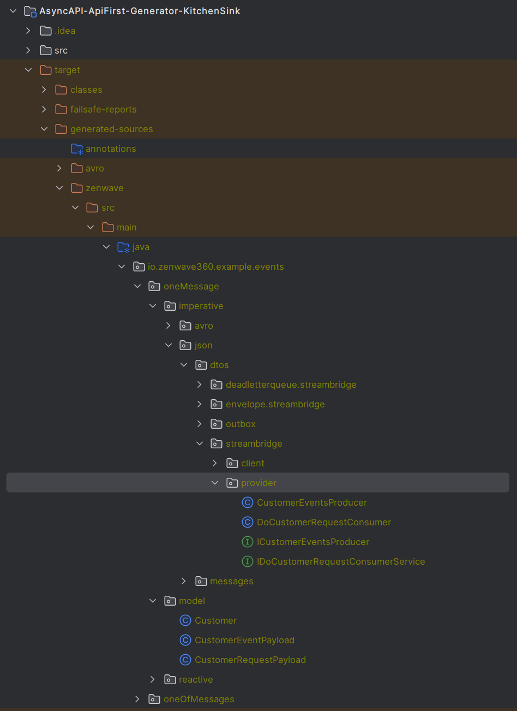

# ZenWave Code Generator for AsyncAPI: API-First Tests, Examples and the Kitchen Sink
> 👉 [ZenWave360](https://zenwave360.github.io/) Helps You Create Software that's Easy to Understand

[](https://search.maven.org/artifact/io.github.zenwave360.zenwave-sdk/zenwave-sdk)
[](https://github.com/ZenWave360/zenwave-sdk/blob/main/LICENSE)

This repository contains a complete set of examples and tests for [ZenWave Code Generator for AsyncAPI](https://zenwave360.github.io/zenwave-sdk/plugins/asyncapi-spring-cloud-streams3/).

<!-- TOC -->
* [ZenWave Code Generator for AsyncAPI: API-First Tests, Examples and the Kitchen Sink](#zenwave-code-generator-for-asyncapi--api-first-tests-examples-and-the-kitchen-sink)
  * [About ZenWave Code Generator for AsyncAPI](#about-zenwave-code-generator-for-asyncapi)
  * [Usage of this Repository](#usage-of-this-repository)
  * [ZenWave AsyncAPI Generated Code in a Nutshell](#zenwave-asyncapi-generated-code-in-a-nutshell)
    * [Provider vs Client](#provider-vs-client)
    * [Using Generated Code to Produce Messages](#using-generated-code-to-produce-messages)
    * [Using Generated Code to Consume Messages](#using-generated-code-to-consume-messages)
  * [Configuring ZenWave Code Generator Maven Plugin for AsyncAPI](#configuring-zenwave-code-generator-maven-plugin-for-asyncapi)
    * [Generating DTOs](#generating-dtos)
    * [Generating Provider or Client Code](#generating-provider-or-client-code)
* [Examples with Tests](#examples-with-tests)
  * Ever-growing list of different flavors
<!-- TOC -->

## About ZenWave Code Generator for AsyncAPI

ZenWave Code Generator can generate code from API-First models such as AsyncAPI and OpenAPI and Domain Specific Models such as JHipster JDL and ZenWave Domain Language ZDL. It comes with a CLI installable via [jbang](https://jbang.dev/) and a Maven Plugin.

With ZenWave's `spring-cloud-streams3` and `jsonschema2pojo` generator plugins you can generate strongly typed **Business Interfaces**, **Payload DTOs** and **Header objects** from AsyncAPI definitions.

It encapsulates SpringCloud Streams 3 API creating abstractions for many Enterprise Integration Patterns for Event Driven Architectures like: Transactional Outbox, Business DeadLetterQueue, Enterprise Envelop, Async Request/Response... behind business oriented interfaces.

## Usage of this Repository

This repository contains:

- AsyncAPI definitions: `src/main/resources/model/asyncapi.yml` and `src/main/resources/model/asyncapi-avro.yml`
- ZenWave Maven Plugin to generate different flavors for producers and consumers in `pom.xml`
- `IntegrationTest` class and accompanying `TestsConfiguration` for each flavor. 

After cloning this repository, you can run the following command to generate the code for all the examples:

```shell
mvn clean generate-sources
```


Each java package contains code to produce and consume messages in different flavors.

If you want to explore how each of these flavors work you can find an `IntegrationTest` class and accompanying `TestsConfiguration` in `src/test/java`. You can run these tests and debug them from your favorite IDE.

## ZenWave AsyncAPI Generated Code in a Nutshell

### Provider vs Client

AsyncAPI definitions are inherently **symmetrical** it's difficult to establish the roles of client/server. ZenWave generates code based on `provider` and `client` roles, where a `provider` "produces events" and "consumes commands". See [ZenWave Spring Cloud Streams Generator](https://zenwave360.github.io/zenwave-sdk/plugins/asyncapi-spring-cloud-streams3/) documentation for more details on "publish/subscribe", "producer/consumer" and "provider/client" roles.

NOTE: a `provider` can both produce (events) and consume (requests/commands) messages for the same API.

Write your AsyncAPI definitions from the `provider` perspective and then configure the code generator to generate either a `provider` or a `client` code.


### Using Generated Code to Produce Messages

In order to produce messages all you need to do is @Autowire the generated producer as part of your code.

```java
// Autogenerated: you can @Autowire it in your code
public interface ICustomerEventsProducer {
    // headers object omitted for brevity
    /**
     * Customer Domain Events
     */
    boolean onCustomerEvent(CustomerEventPayload payload, CustomerEventPayloadHeaders headers);

}
```

```java
// Autogenerated: add it to your autoscan packages
@Component
public class CustomerEventsProducer implements ICustomerEventsProducer {
    
    // details omitted for brevity
    
    /**
     * Customer Domain Events
     */
    public boolean onCustomerEvent(CustomerEventPayload payload, CustomerEventPayloadHeaders headers) {
        // this is one of the many flavors, you shouldn't need to worry about the details
        log.debug("Sending message to topic: {}", onCustomerEventBindingName);
        Message message = MessageBuilder.createMessage(payload, new MessageHeaders(headers));
        return streamBridge.send(onCustomerEventBindingName, message);
    }
}
```

```java
// Autowire this producer in your code
@Autowired
ICustomerEventsProducer customerEventsProducer;

// and use it to produce messages
var message = new CustomerEventPayload()
        .withCustomerId("123")
        // [...] set some more data
        .withEventType(CustomerEventPayload.EventType.CREATED);
// notice how headers are also strongly typed
var headers = new ICustomerEventsProducer.CustomerEventPayloadHeaders()
        .entityId("123")
        .commonHeader("value")
        .set("undocumented-header", "value");

customerEventsProducer.onCustomerEvent(message, headers);
```

### Using Generated Code to Consume Messages

On the consumer side generates:

- Functional Consumer `DoCustomerRequestConsumer`  for Spring Cloud Streams bindings.
- Business Interface `IDoCustomerRequestConsumerService` you need to implement in order to receive strongly typed messages.

This Functional Consumer can abstract away different integration patterns like Business Dead Letter Queue and others... depending on how you configure zenwave maven generator.

**To consume messages you need to implement generated business interface and register it as a Spring bean.**

```java
// Autogenerated: you need to implement and provide this business interface
public interface IOnCustomerEventConsumerService {
    /**
     * Customer Domain Events
     */
    default void onCustomerEvent(CustomerEventPayload payload, CustomerEventPayloadHeaders headers) {};
}
```

```java
// Autogenerated: add it to your autoscan packages and provide business interface implementation
@Component("on-customer-event")
public class OnCustomerEventConsumer implements Consumer<Message<CustomerEventPayload>> {

    // you need to implement this interface
    protected IOnCustomerEventConsumerService service;

    @Override
    public void accept(Message<CustomerEventPayload> message) {
        log.debug("Received message: {}", message);
        try {
            Object payload = message.getPayload();
            if (payload instanceof CustomerEventPayload) {
                var headers = new IOnCustomerEventConsumerService.CustomerEventPayloadHeaders();
                headers.putAll(message.getHeaders());
                service.onCustomerEvent((CustomerEventPayload) payload, headers);
                return;
            }
            log.warn("Received message without any business handler: [payload: {}, message: {}]", payload.getClass().getName(), message);
        } catch (Exception e) {
            // error handling and dead-letter-queue routing omitted for brevity
        }
    }
}
```

```java
// Implement the business interface and add it to your context
@Component
class DoCustomerRequestConsumerService implements IDoCustomerRequestConsumerService {

    @Override
    public void doCustomerRequest(CustomerRequestPayload payload, CustomerRequestPayloadHeaders headers) {
        log.info("Received '{}' message with payload: {}", payload.getClass(), payload);
        // [...] do something with this message
    }
}
```

## Configuring ZenWave Code Generator Maven Plugin for AsyncAPI

### Generating DTOs

Documentation: 
https://zenwave360.github.io/zenwave-sdk/plugins/asyncapi-jsonschema2pojo/

Example on this repo:
https://github.com/ZenWave360/AsyncAPI-ApiFirst-Generator-KitchenSink/blob/main/pom.xml#L284

### Generating Provider or Client Code

Documentation: https://zenwave360.github.io/zenwave-sdk/plugins/asyncapi-spring-cloud-streams3/


# Examples with Tests

This is an ever-growing list of examples with tests of different implementation flavors:

<!-- TOC -->
* [Examples with Tests](#examples-with-tests)
  * [Imperative Flavor with JSON DTOs](#imperative-flavor-with-json-dtos)
    * [Plain StreamCloudStreams Implementation](#plain-streamcloudstreams-implementation)
    * [With EnterPrise Envelope](#with-enterprise-envelope)
    * [With DeadLetterQueue Routing](#with-deadletterqueue-routing)
    * [With MongoDB Transactional Outbox](#with-mongodb-transactional-outbox)
    * [With Plain SQL Transactional Outbox](#with-plain-sql-transactional-outbox)
  * [Imperative Flavor with Avro DTOs](#imperative-flavor-with-avro-dtos)
    * [Plain StreamCloudStreams Implementation](#plain-streamcloudstreams-implementation-1)
    * [With EnterPrise Envelope](#with-enterprise-envelope-1)
    * [With DeadLetterQueue Routing](#with-deadletterqueue-routing-1)
    * [With MongoDB Transactional Outbox](#with-mongodb-transactional-outbox-1)
    * [With Plain SQL Transactional Outbox](#with-plain-sql-transactional-outbox-1)
    * [Exposing Spring Messages](#exposing-spring-messages)
  * [Reactive Flavor with JSON DTOs](#reactive-flavor-with-json-dtos)
    * [Plain StreamCloudStreams with JSON DTOs](#plain-streamcloudstreams-with-json-dtos)
    * [Plain StreamCloudStreams with JSON Messages (and Headers)](#plain-streamcloudstreams-with-json-messages--and-headers-)
<!-- TOC -->



## Imperative Flavor with JSON DTOs

### Plain StreamCloudStreams Implementation

Provider: https://github.com/ZenWave360/AsyncAPI-ApiFirst-Generator-KitchenSink/blob/main/pom.xml#L316

Client: https://github.com/ZenWave360/AsyncAPI-ApiFirst-Generator-KitchenSink/blob/main/pom.xml#L333

### With Enterprise Envelope

Provider: https://github.com/ZenWave360/AsyncAPI-ApiFirst-Generator-KitchenSink/blob/main/pom.xml#L351

Client: https://github.com/ZenWave360/AsyncAPI-ApiFirst-Generator-KitchenSink/blob/main/pom.xml#L370

Envelop Wrapper/Unwrapper: https://github.com/ZenWave360/AsyncAPI-ApiFirst-Generator-KitchenSink/blob/main/src/main/java/io/zenwave360/example/events/support/model/EnvelopeWrapperUnWrapper.java#L8

```java
class EnvelopeWrapperUnWrapper implements CustomerEventsProducer.EnvelopeWrapper, OnCustomerEventConsumer.EnvelopeUnWrapper {
    @Override
    public Object wrap(Object payload) {
        var envelope = new Envelope();
        envelope.setPayload((CustomerEventPayload) payload);
        return envelope;
    }

    @Override
    public Object unwrap(Object envelope) {
        return ((Envelope) envelope).getPayload();
    }
}
```

```yaml
channels:
  customer.events:
    publish:
      summary: Customer Domain Events
      operationId: onCustomerEvent
      x-envelope-java-type: io.zenwave360.example.events.support.model.Envelope
```

### With DeadLetterQueue Routing

Provider: https://github.com/ZenWave360/AsyncAPI-ApiFirst-Generator-KitchenSink/blob/main/pom.xml#L390

Client: https://github.com/ZenWave360/AsyncAPI-ApiFirst-Generator-KitchenSink/blob/main/pom.xml#L407

Configuration: https://github.com/ZenWave360/AsyncAPI-ApiFirst-Generator-KitchenSink/blob/main/src/test/resources/application-deadletterqueue.yml#L6

```yaml
spring:
  cloud:
    stream:
      bindings:
        on-customer-event-in-0:
          dead-letter-queue-error-map: >
            {
              'jakarta.validation.ValidationException': 'on-customer-event-validation-error-out-0',
              'java.lang.Exception': 'on-customer-event-error-out-0'
            }
```

### With MongoDB Transactional Outbox

Provider: https://github.com/ZenWave360/AsyncAPI-ApiFirst-Generator-KitchenSink/blob/main/pom.xml#L425

Client: https://github.com/ZenWave360/AsyncAPI-ApiFirst-Generator-KitchenSink/blob/main/pom.xml#L443

Outbox: https://github.com/ZenWave360/AsyncAPI-ApiFirst-Generator-KitchenSink/blob/main/src/test/java/io/zenwave360/example/events/oneMessage/imperative/json/dtos/outbox/mongodb/TestsConfiguration.java#L67

```java
// Example implementation of a MongoDB ChangeStream listener
@Bean(destroyMethod = "stop")
public MessageListenerContainer configCustomerEventOutboxCollectionChangeStreams(
        MongoTemplate template, 
        CustomerEventsProducer customerEventsProducer // this is your autogenerated producer
        ) {
    var changeStreamOptions = ChangeStreamOptions.builder();
    // getting refresh token from autogenerated producer
    var resumeToken = customerEventsProducer.getOnCustomerEventResumeToken();
    if(resumeToken != null) {
        changeStreamOptions.resumeAfter(resumeToken);
    }

    // improve performance by persisting resume token only after 10 messages
    customerEventsProducer.skipMessagesBeforePersistingResumeToken = 10;

    final var container = new DefaultMessageListenerContainer(template);
    final var options = new ChangeStreamRequestOptions(null, customerEventsProducer.onCustomerEventOutboxCollection, changeStreamOptions.build());
    // registering autogenerated listener 'customerEventsProducer.onCustomerEventMongoChangeStreamsListener'
    container.register(new ChangeStreamRequest<>(customerEventsProducer.onCustomerEventMongoChangeStreamsListener, options), Map.class);
    container.start();
    return container;
}
```

### With Plain SQL Transactional Outbox

Provider: https://github.com/ZenWave360/AsyncAPI-ApiFirst-Generator-KitchenSink/blob/main/pom.xml#L462

Client: https://github.com/ZenWave360/AsyncAPI-ApiFirst-Generator-KitchenSink/blob/main/pom.xml#L480

Outbox: https://github.com/ZenWave360/AsyncAPI-ApiFirst-Generator-KitchenSink/blob/main/src/test/java/io/zenwave360/example/events/oneMessage/imperative/json/dtos/outbox/jdbc/TestsConfiguration.java#L84

```java
// Not ready for production example implementation of a JDBC outbox pulling listener
@Autowired
JdbcTemplate jdbcTemplate;

@Autowired
CustomerEventsProducer customerEventsProducer;

@Scheduled(fixedDelay = 1000)
public void pullCustomerEventsProducerOutbox() {
    String tableName = customerEventsProducer.onCustomerEventOutboxTableName;
    log.info("Pulling outbox table: {}", tableName);
    var rows = jdbcTemplate.queryForList("SELECT * FROM " + tableName + " WHERE sent_at IS NULL ORDER BY id ASC");
    log.info("Found {} rows", rows.size());
    for (var row : rows) {
        try {
            processCustomerEventsProducerOutboxRow(row, tableName);
        } catch (Exception e) {
            e.printStackTrace();
            break;
        }
    }
}

@Transactional(propagation = Propagation.REQUIRES_NEW)
public void processCustomerEventsProducerOutboxRow(Map<String, Object> row, String tableName) throws Exception {
    customerEventsProducer.sendOutboxMessage(row);
    jdbcTemplate.update("UPDATE " + tableName + " SET sent_at = current_timestamp() WHERE id = ?", row.get("id"));
}
```
## Imperative Flavor with Avro DTOs

### Plain StreamCloudStreams Implementation

Provider: https://github.com/ZenWave360/AsyncAPI-ApiFirst-Generator-KitchenSink/blob/main/pom.xml#L845

Client: https://github.com/ZenWave360/AsyncAPI-ApiFirst-Generator-KitchenSink/blob/main/pom.xml#L862

### With EnterPrise Envelope

Provider: https://github.com/ZenWave360/AsyncAPI-ApiFirst-Generator-KitchenSink/blob/main/pom.xml#L880

Client: https://github.com/ZenWave360/AsyncAPI-ApiFirst-Generator-KitchenSink/blob/main/pom.xml#L899

```java
class AvroEnvelopeWrapperUnWrapper implements CustomerEventsProducer.EnvelopeWrapper, OnCustomerEventAvroConsumer.EnvelopeUnWrapper {
    @Override
    public Object wrap(Object payload) {
        var envelope = new Envelope();
        envelope.setPayload(payload);
        return envelope;
    }

    @Override
    public Object unwrap(Object envelope) {
        return ((Envelope) envelope).getPayload();
    }
}
```

### With DeadLetterQueue Routing

### With MongoDB Transactional Outbox

https://github.com/ZenWave360/AsyncAPI-ApiFirst-Generator-KitchenSink/blob/main/pom.xml#L920

### With Plain SQL Transactional Outbox

https://github.com/ZenWave360/AsyncAPI-ApiFirst-Generator-KitchenSink/blob/main/pom.xml#L957

### Exposing Spring Messages

https://github.com/ZenWave360/AsyncAPI-ApiFirst-Generator-KitchenSink/blob/main/pom.xml#L995

## Reactive Flavor with JSON DTOs

NOTE: Only Consumer Reactive flavor is currently implemented. Producer implementation is still blocking/imperative.


### Plain StreamCloudStreams with JSON DTOs

https://github.com/ZenWave360/AsyncAPI-ApiFirst-Generator-KitchenSink/blob/main/pom.xml#L617

In order to consume messages reactively you need to implement a business interface like this:

```java
// provide this business interface implementation
@Component
class OnCustomerEventConsumerService implements IOnCustomerEventConsumerService {

    @Override
    public void onCustomerEvent(Flux<CustomerEventPayload> msg) {
        msg.subscribe(payload -> {
            log.debug("Received message: {}", payload);
            // do something with this payload
        });
    }
}
```

### Plain StreamCloudStreams with JSON Messages (and Headers)

https://github.com/ZenWave360/AsyncAPI-ApiFirst-Generator-KitchenSink/blob/main/pom.xml#L727

```java
// provide this business interface implementation
@Component
class OnCustomerEventConsumerService implements IOnCustomerEventConsumerService {

    @Override
    public void onCustomerEvent(Flux<Message<CustomerEventPayload>> messageFlux) {
        messageFlux.subscribe(message -> {
            log.info("Received '{}' message with payload: {}", message.getClass(), message);
            // do something with this payload and headers
        });
    }
}
```
